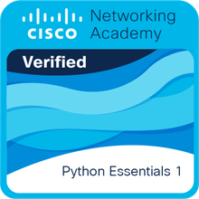
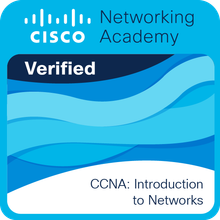
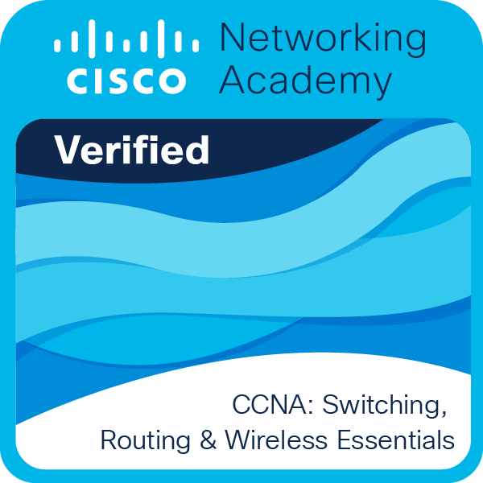
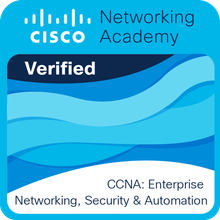

# Computer Science Student and Aspiring Cybersecurity Engineer

Hi, I'm **Jana**  
💻 Computer Science Student  
🔐 Future Cybersecurity Engineer

---

## Certifications

  
  
  
  
  
  

---

## Contact

- **Email**: markovicjana@elfak.com  

  

