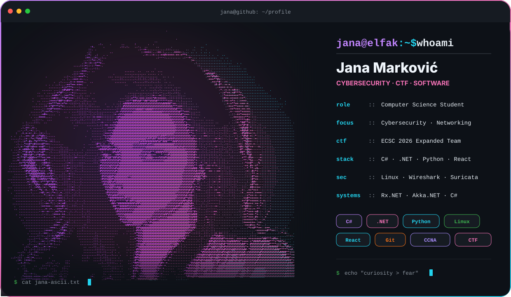

  

<h1 align="center">Jana Marković</h1>

  <b>Computer Science Student · Aspiring Cybersecurity Engineer · CTF Player</b> 
  Expanded National Team Member — ECSC 2026

  
  
  

  

<b>Certifications</b>

 

  
  
  
  
  
  

